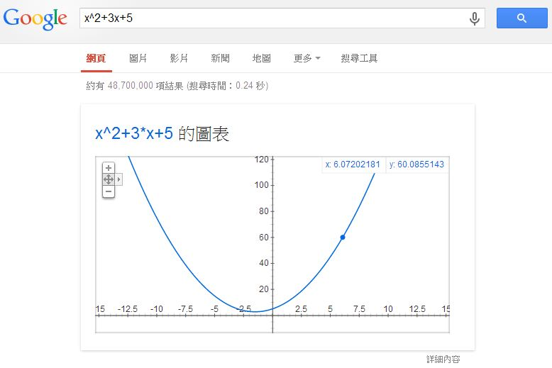
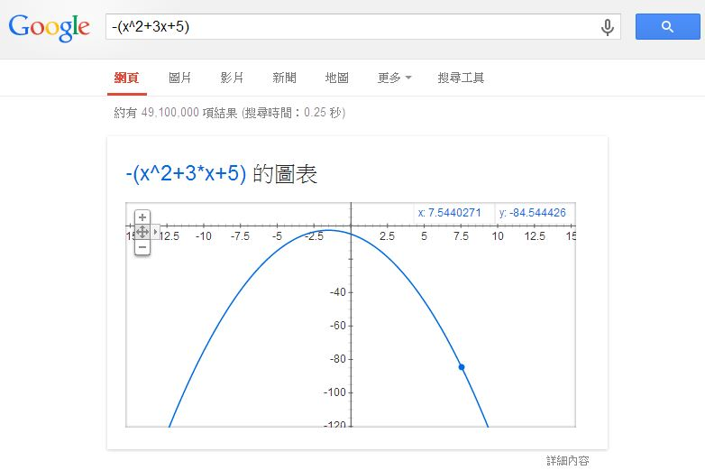
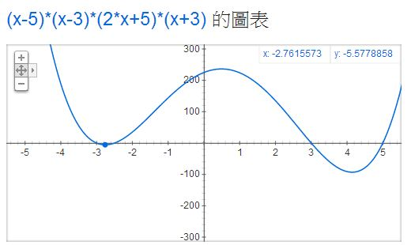
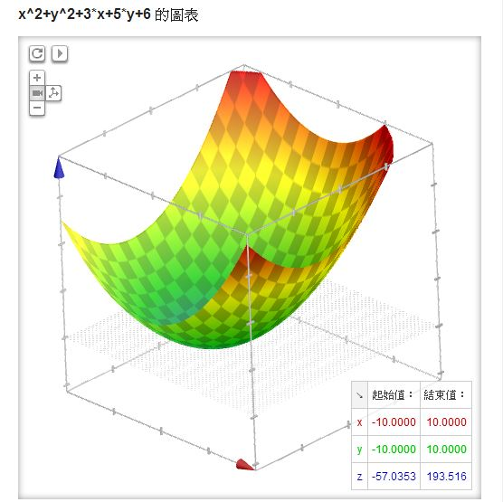

# 第 2 章 - 爬山演算法 Hill-Climbing

爬山演算法 (Hill Climbing) 是一種最簡單的優化算法，該方法就像模擬人類爬山時的行為而設計的，因此稱為爬山演算法。

程式究竟要怎麼爬山呢？且讓我們用一張圖來看看。

假如我們在 Google 裏輸入一個算式，Google 會幫我們畫出該函數。舉例而言，如果我在 Google 輸入 `x^2+3x+5` 這個算式，您會看到下列圖形：



這時您可以移動滑鼠，圖形會出現一個可移動的小藍點，該點會沿著曲線移動，上圖中 (x, y) 座標顯示為 x:6.07202181, y:60.0855143，
就是那個小藍點所在的位置。

如果我們想要寫程式尋找這個函數的最低點，那我們應該怎麼找呢？

其實方法很簡單，就是一直往低的地方走，一直走到最低點，然後你會看到左右兩邊都沒辦法更低了，於是就停止尋找，傳回該最低點作為答案。

這個方法，就像是水往低處流一樣，不斷的往更低的方向流，最後一定會流到一個山谷，然後就積成一個湖了。

但是、既然這樣，那為甚麼叫做爬山演算法，而不叫「流水下山演算法」呢？

其實、只要反過來看就行了，如果我們想要找的是最高點，而不是最低點，那整個行為就會像爬山一樣，只是最後爬到山頂就會停了。

採用這種想法，若我們想找 $x^2+3x+5$ 這個函數的最高，我們可以在 Google 輸入 `-(x^2+3x+5)` 就可以看到那座山了，以下是 Google 顯示的結果：



當然、如果函數有很多山峰，那這種方法只能走到小山丘就會停了。這時您可能會說，那為甚麼不再繼續往更高的山走去呢？

關於這點，並不是不行，只是程式沒有眼睛，也沒辦法一眼望去把所有的地形都給看光，然後知道更高的山峰在哪裡？

如果我們用上面水往低處流的想法，您就會清楚爬山演算法所遭遇的困難了。當您像水一樣往下流，到了谷底之後，由於四周都是山壁，所以您根本看不到更低的谷到底在哪裡，所以只好就停下來了。

此時、除非你爬出山谷，否則根本不可能找到更深的谷，這就是「流水下山演算法」所遭遇到的困難了。以下是我們用 Google 顯示 `(x-5)*(x-3)*(2x+5)*(x+3)` 這個具有兩個山谷的函數，所得到的圖形。



假如我們在上圖中左邊的山谷，那麼怎麼能知道右邊還有一個更低的山谷呢？這就是「流水下山演算法」的困難之所在了！

當然、也有人試圖提出一些企圖找到更深的谷，或爬到更高的山的演算法，這些演算法往往是以爬山演算法為基礎，然後再作一些改良，像是「模擬退火演算法」(Simulated Annealing Algorithm) 或大洪水演算法 (Great Deluge algorithm) 等等，這些方法都是企圖讓「流水下山演算法」有機會跳出山谷而設計的方法。

當然、您也可以企圖加上「衝力」之類的想法讓「流水下山演算法」可以衝出低谷，但是到底要衝多久，還有該往哪個方向衝才對呢？那這種方法是否該改叫「衝山演算法」呢？

當然、我是沒有聽過這種名稱啦！

另外、對於上述的單變數函數而言，不是往左邊走就是往右邊走，但是如果有兩個變數，例如像 `x^2+y^2+3x+5y+6` ，但是只有一個山谷，那麼我們該修改哪個變數呢？舉例而言，以下就是 Google 所畫出的 `x^2+y^2+3x+5y+6` 之圖形。

 

在上述的雙變數情形中，我們可以隨機的挑一個變數，然後向左或向右移動一小步，只要移動後的點更低就接受，如果連續很多次移動都沒辦法找到更低的點，就認為已經到達山谷，這樣的方法其實還蠻有效的，這種方法可以稱為「隨機下山演算法」 (反過來英文中以爬山的角度來看，所以稱為隨機爬山演算法 Stochastic Hill Climbing Algorithm)。

當然、隨機的方法有時會比較沒效率，如果我們可以很容易的透過微積分計算斜率 (導數) 的話，那麼不管幾個變數，我們都可以計算出山坡上最陡峭的那一個方向，這種微積分概念稱為「梯度」，而這也是我們下一章要討論的內容。

## 實作：以爬山演算法尋找函數最高點

### 簡介

以下是「爬山演算法」 (Hill-Climbing Algorithm) 的一個簡易版本，其方法超簡單，就是一直看旁邊有沒有更好的解，如果有就移過去。然後反覆的作這樣的動作，直到旁邊的解都比現在的更差時，程式就停止，然後將那個位於山頂的解傳回，就完成了。

```js
Algorithm HillClimbing(f, x)
  x = 隨意設定一個解。
  while (x 有鄰居 x' 比 x 更高)
    x = x';
  end
  return x;
end
```

當然、這種演算法只能找到「局部最佳解」(local optimal)，當整個空間有很多山頂的時候，這種方法會爬到其中一個山頂就停了，並不一定會爬到最高的山頂。 

### 程式碼

檔案： HillClimbingSimple.js

```javascript
var util = require("util");
var log = console.log;

function f(x) { return -1*(x*x+3*x+5); }
// function f(x) { return -1*Math.abs(x*x-4); }

var dx = 0.01;

function hillClimbing(f, x) {
  while (true) {
    log("f(%s)=%s", x.toFixed(4), f(x).toFixed(4));
    if (f(x+dx) >= f(x))
	x = x+dx;
    else if (f(x-dx) >= f(x))
	x = x-dx;
    else
	break;
  }
}

hillClimbing(f, 0.0);
```

### 執行結果

求解 : $-(x^2+3x+5)$ 的最高點，也就是 $x^2+3x+5$ 的最低點。

```
D:\Dropbox\Public\web\ai\code\optimize>node hillClimbingSimple
f(0.0000)=-5.0000
f(-0.0100)=-4.9701
f(-0.0200)=-4.9404
f(-0.0300)=-4.9109
f(-0.0400)=-4.8816
f(-0.0500)=-4.8525
...
f(-1.4500)=-2.7525
f(-1.4600)=-2.7516
f(-1.4700)=-2.7509
f(-1.4800)=-2.7504
f(-1.4900)=-2.7501
f(-1.5000)=-2.7500
```

如果我們將上述程式的 f(x) 換成註解中的那個，也就是將 f(x) 換成如下版本：

```js
function f(x) { return -1*Math.abs(x*x-4); }
```

那麼就可以用來求解 $|x^2-4|$ 的最低點，也就是尋找 4 的平方根，以下是執行結果：

```
D:\Dropbox\Public\web\ai\code\optimize>node hillClimbingSimple
f(0.0000)=-4.0000
f(0.0100)=-3.9999
f(0.0200)=-3.9996
f(0.0300)=-3.9991
f(0.0400)=-3.9984
f(0.0500)=-3.9975
...
f(1.9500)=-0.1975
f(1.9600)=-0.1584
f(1.9700)=-0.1191
f(1.9800)=-0.0796
f(1.9900)=-0.0399
f(2.0000)=-0.0000
```

您可以看到上述程式正確的找到 4 的平方根是 2，而我們所用的方法與求解 $-(x^2+3x+5)$ 的最高點幾乎是一模一樣的，只是把函數換掉而已。

### 結語

您可以看到上述用爬山演算法尋找函數最高點或最低點的程式，其實非常的簡單，只不過是看看兩邊是否有更好的解，如果有就移過去罷了。

但是、這麼簡單的演算法，其實威力是非常強大的，這種方法可以求解的問題非常的多，很多人工智慧上非常重要的問題，其實都只不過是在進行函數優化的動作，也就是尋找某個函數的低點或高點而已，這些問題其實大部分都可以使用爬山演算法來求解。

當然、要能尋找更複雜函數的「區域最佳解」，還必須進一步的對上述程式進行封裝與抽象化，我們將在下一篇文章中解說將上述爬山程式抽象化後的版本，並用該程式來求更複雜函數的解。

### 參考文獻
* [Wikipedia:Hill climbing](http://en.wikipedia.org/wiki/Hill-climbing)
* [Wikipedia:Great Deluge algorithm](http://en.wikipedia.org/wiki/Great_Deluge_algorithm)
* [Wikipedia:Simulated annealing](http://en.wikipedia.org/wiki/Simulated_annealing)
* [Wikipedia:Stochastic hill climbing](http://en.wikipedia.org/wiki/Stochastic_hill_climbing)
* [Wikipedia:Gradient descent](http://en.wikipedia.org/wiki/Gradient_descent)
* [Wikipedia:Greedy algorithm](http://en.wikipedia.org/wiki/Greedy_algorithm)
* [維基百科：爬山演算法](http://zh.wikipedia.org/wiki/%E7%88%AC%E5%B1%B1%E7%AE%97%E6%B3%95)
* [維基百科：模擬退火](http://zh.wikipedia.org/wiki/%E6%A8%A1%E6%8B%9F%E9%80%80%E7%81%AB)
* [維基百科：梯度下降法](http://zh.wikipedia.org/wiki/%E6%A2%AF%E5%BA%A6%E4%B8%8B%E9%99%8D%E6%B3%95)
* [維基百科：貪心法](http://zh.wikipedia.org/wiki/%E8%B4%AA%E5%BF%83%E6%B3%95)


<!--
## 爬山演算法

首先， 讓我們看一個最簡單的開放式方法， 這個方法稱為《爬山演算法》！

爬山演算法，是通用的《優化演算法》，也就是用來尋找好的解，並不只是用來解方程的。

假如尋找的是《極大值》，那麼就是《爬山演算法》，如果尋找的是《極小值》，那麼就變成了《下山演算法》。

而且爬山演算法這類的優化算法， 很容易就可以用來找方程式的解。

因為我們只要最小化絕對值 |f(x)-0| 就可以了！

爬山演算法的想法很簡單， 就是先隨便選一個起點 (例如 x=0)， 然後每次都比較 f(x) 和左邊的 f(x-dx) 與右邊 f(x+dx) 的值，假如左邊比較好，就往左邊走。 如果右邊比較好，就走右邊。如果左邊右邊都比現在的 f(x) 差，那麼現在的 x 就是個《區域最佳解》。


假如到區域最佳解時， 還沒有找到 |f(x)-0| 很接近零的解，那麼這次尋找就失敗了。

此時我們可以另選個起點繼續找，或者直接傳回尋找失敗。

以下是《爬山演算法》的程式碼， 該程式碼求解方程式 $$x^2-4x+1=0$$ 的根。

檔案： hillClimbing.js

```javascript
function f(x) {
 return -1*Math.abs(x*x-4*x+1);
}

var dx = 0.01;

function hillClimbing(f, x) {
 while (true) {
   if (f(x+dx) >= f(x))
     x = x+dx;
   else if (f(x-dx) >= f(x))
     x = x-dx;
   else
     return x;
 }
}

var x=hillClimbing(f, 0.0);
console.log("x=", x, "f(x)=", f(x));
```

執行結果：

```
D:\Dropbox\gitbook\rlab\code\solveEquation>node hillClimbing.js
x= 0.2700000000000001 f(x)= -0.007100000000000328
```

但是《爬山演算法》的速度並沒有很快，雖然還可以接受。

而且《爬山演算法》常常會落在《區域最佳解》出不來，因而有可能找不到《方程式的解》。

所以爬山演算法很少用來《解方程式》，而是比較常用在求解人工智慧的優化問題上！

-->
